# Picollo Integration Core Module

Picollo is a modular solution designed for systems integration and microservices development, built on open-source Java-based SpringBoot and Spring frameworks (*1).

It combines the ease of development of production-grade Spring-based applications with the flexibility of a modular dynamic engine. This modularization provides a faster time to market, as the reuse of support and business modules brings increased productivity in application development. The fusion of SpringBoot with dynamic modules empowers Picollo to deploy components and configurations at runtime, making it a continuously available service. Hence, Picollo is often referred to as "Picollo the non-stop service", serving both systems integration and microservices creation needs.

The roadmap for Picollo aims to transform it from a single node execution module into a highly available and scalable platform for developing **Pico Modules** (integration interfaces or microservices). The term "Pico Modules" describes the capability to deploy business logic in small, granular modules, seamlessly integrated into the Picollo service in a non-stop manner (hot pluggable modules).

(*1): The substrate to run Picollo is SpringBoot nowadays, however it may have another variants in the future with Quarkus and other lightweight options. 

## Features
The picture below presents Picollo's node components that are part of its architecture:

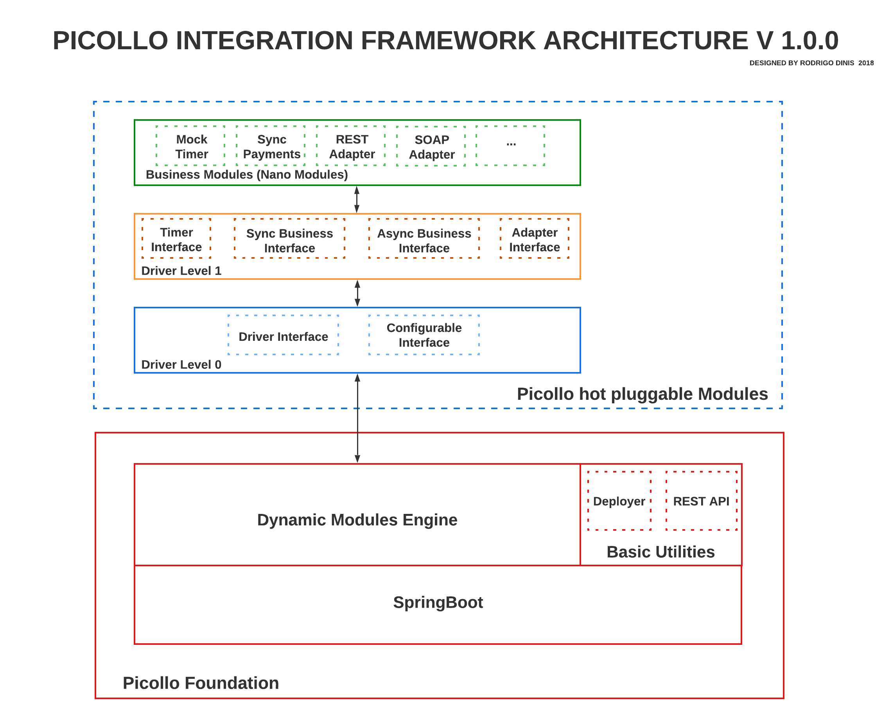

In the Picollo's layered architecture the following high-level components are presented:

- Picollo Foundation
- Picollo Hot Pluggable Modules

The Picollo Foundation is the basic framework structure for the entire backend solution, and the Picollo Hot Pluggable Modules are modules in many levels responsible for the dynamic interfaces and business implementations (pico modules). 

The Picollo Foundation is composed of the following internal components:

- Substrate
- Basic Utilities
- Dynamic Modules Engine

The Substrate is implemented with SpringBoot which is an open-source Java framework used to create Microservices (In the Picollo's development road map it should support also Quarkus). On top of the Substrate we have the Basic Utilities and Dynamic Module Engine.
The Basic Utilities module is where the core basic most important functionalities are located, in the picture you can see we have the Deployer and REST API functionalities. These are responsible for deploying pico modules and offer a RESTful API to manage the Picollo node respectively.
Dynamic Modules Engine is the modular system for Java that provides the ability to support a pluggable architecture of hot swap modules. 

On top of the Picollo Foundation we find the Picollo Hot Pluggable Modules, where the following internal components are:

- Driver Level 0
- Driver Level 1
- Pico Modules

The Driver Level 0 provides the dynamic interfaces Driver Interface, Credential Manager and Configurable Interface. The first is to provide a generic driver hook whereas the second provides configurable vault for credentials, and the last supplies the configuration interface responsible for the pico module configuration properties.
Regarding the Driver Level 1, it is an implementation of the level 0, bringing higher level horizontal backend interfaces based on the hexagonal architecture (https://en.wikipedia.org/wiki/Hexagonal_architecture_(software)).
The hexagonal architecture, as we know, has business model in the core and adapters to interact with the external systems. On the Driver Level 1 the Timer, Sync Business, and Async Business are interfaces for implementing the business model whereas the Adapter Interface, as the name says, is used as adapter for external system interactions (I/O). 
For more details about the Driver Level 1 see the wiki documentation.

Finally, the top level components are the Pico Modules. They are dynamic business and I/O adapter modules included in runtime into the Picollo node. Here is where the logic is customized, processed, data is read, transformed, and written. The picture presents the following dummy custom modules:

- Mock Timer
- Sync Payments
- REST Adapter
- SOAP Adapter

The Mock Timer is a dummy module processing timer batch processes, it implements the Timer Interface on Driver Level 1 layer.  
The Sync Payments is a dummy business logic module to process payments created here as a sample scenario. In this scenario, the Sync Payment module receives payments from a system (SAP for instance) through a RESTful API, using the REST Adapter to connect and fetch data the system. After fetching the data it is processed by the Sync Payment module which will use the SOAP Adapter to send the processed payment to the Accounting System (Another SAP module for instance) using the SOAP Adapter.    

## Folder structure

The Picollo code comes with the following file system structure:
```
.
├── README.md                 <-- Instructions file
├── LICENSE                   <-- License file
├── code/                     <-- Picollo's core source code & binary drivers (jar files)
│    └── config/              <-- Driver's configuration folder (property files for each driver instance)
│    └── core/                <-- Folder where the Picollo's source code is located
│    └── core-modules/        <-- Core modules folder (modules, a.k.a. driver's, foundation interfaces)
│    └── custom-modules/      <-- Drivers folder (module implementations of the foundation interfaces to provide business specific implementations)
│    └── service-modules/     <-- Intermediate service module folder (WIP)
│    └── deploy/              <-- Deployment folder add here drivers to be deployed (the drivers would be moved after deployed to core or custom directories according to the driver type)
│    └── keys/                <-- Security keys folder
│    └── logs/                <-- Logging directory (logs are separated by module/connectors)
│    └── storage/             <-- Internal dynamic modules control directory
```

## Usage

To start developing Picollo and run it in development mode execute the following steps:

1. Download & Install JDK 8+ from here: https://docs.aws.amazon.com/corretto/latest/corretto-8-ug/downloads-list.html
2. Download & Install IntelliJ Idea IDE from here: https://www.jetbrains.com/idea/download
3. Open the terminal (I am considering you are on a Linux or Mac)
4. Create a folder under your user's home directory named "picollo-source". 
5. Move to this directory to clone the repositories named in the next step
6. Clone the Picollo source code from here: git clone https://github.com/DinizR/picollo.git
7. Clone the Picollo drivers level 0 from here: git clone https://github.com/DinizR/picollo-driver-level0.git
8. Clone the Picollo drivers level 1 from here: git clone https://github.com/DinizR/picollo-driver-level1.git
9. Clone the timer drivers implementation from here: git clone https://github.com/DinizR/picollo-timer-drivers.git

The item 4 is optional, only take it if you want to use the timer drivers functionality.

You should have this directory structure on your root Picollo source folder:

```
.
├── picollo-source/
│    └── picollo/   
│    └── picollo-driver-level0/     
│    └── picollo-driver-level1/
│    └── picollo-timer-drivers/
```

Now to open the Picollo project and run the Picollo Foundation follow the steps:

1. Open IntelliJ Idea IDE, you will see:  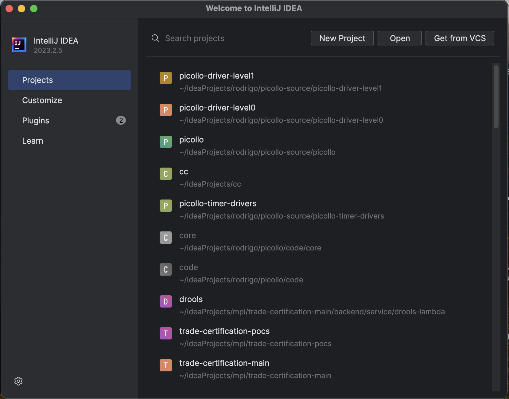
2. Select the "Open" button and navigate to the directory named "picollo" then select it.
3. You will have IntelliJ opened go to the project view on the left pane
4. Select the folders "code" --> "src" --> "main" --> "java" --> "org.picollo.Picollo" 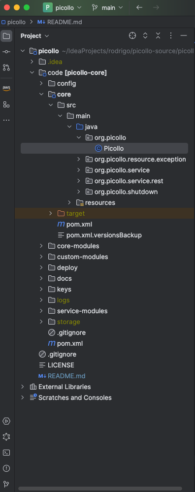
5. Right-click the selected Java file named Picollo.java
6. On the pop-up menu select "Run 'Picollo.main()'
7. You should see this on your IntelliJ Run view: 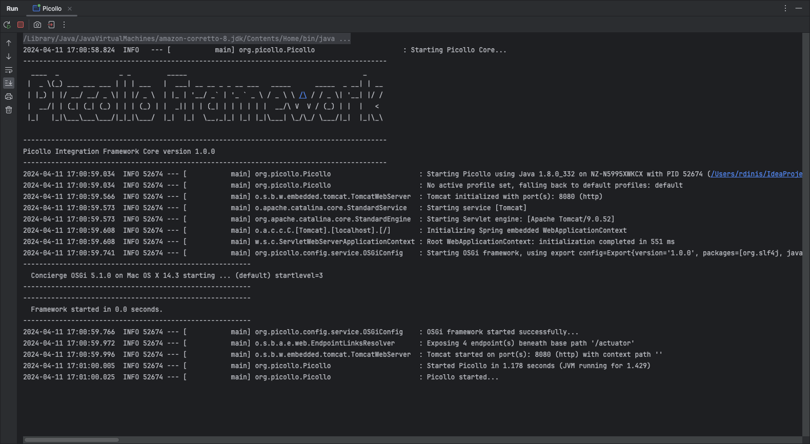

Now that the Picollo Foundation running, lets build and install the Picollo Hot Pluggable Modules.
To install and run the Mock Timer pico module, do the following:

1. On IntelliJ, select the menu File --> Open...
2. Navigate to the "picollo-driver-level0" directory
3. An "Open Project" popup window will appear, select the button "New Window"
4. On IntelliJ, select the menu File --> Open...
5. Navigate to the "picollo-driver-level1" directory
6. An "Open Project" popup window will appear, select the button "New Window"
7. On IntelliJ, select the menu File --> Open...
8. Navigate to the "picollo-timer-drivers" directory
9. An "Open Project" popup window will appear, select the button "New Window"

You will have 4 IntelliJ instances running each project, now we need to build and install "picollo-driver-level0" and "picollo-driver-level1" on your local maven repository. Follow the steps to build and install "picollo-driver-level0":

1. Open your IntelliJ window with "picollo-driver-level0" project
2. Select the Maven view on IntelliJ on the right panel, like this: 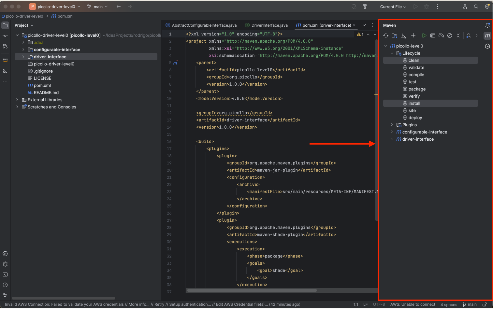
3. Then press Control key and select "clean" and "install" on your Maven view
4. After selecting click on "Run Maven Build" button (the green one on top of Maven View)
5. You should see the modules built on the Run view of IntelliJ, like this: 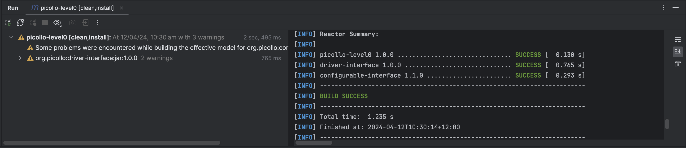

Now we go to the level 1 of interfaces, follow the steps to build and install "picollo-driver-level1":

1. Open your IntelliJ window with "picollo-driver-level1" project
2. Select the Maven view on IntelliJ on the right panel, like this: 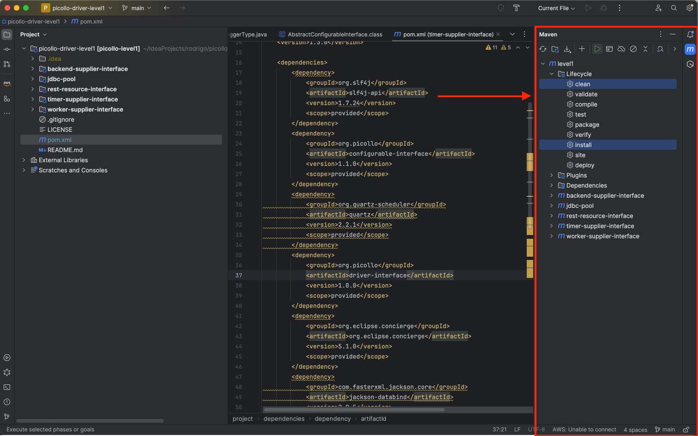
3. Then press Control key and select "clean" and "install" on your Maven view
4. After selecting click on "Run Maven Build" button (the green one on top of Maven View)
5. You should see the modules built on the Run view of IntelliJ, like this: 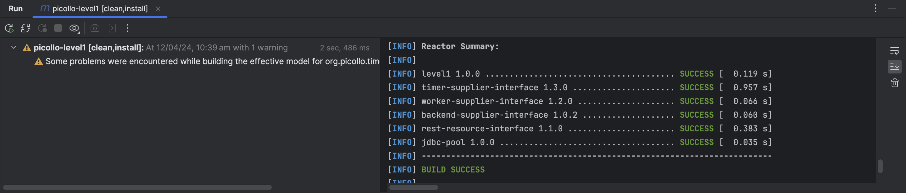

Finally, we are going to deploy a pico module to understand how modules are deployed on Picollo on runtime. Follow the steps:

1. Open your IntelliJ window with "picollo-timer-drivers" project
2. Select the Maven view on IntelliJ on the right panel, like this: 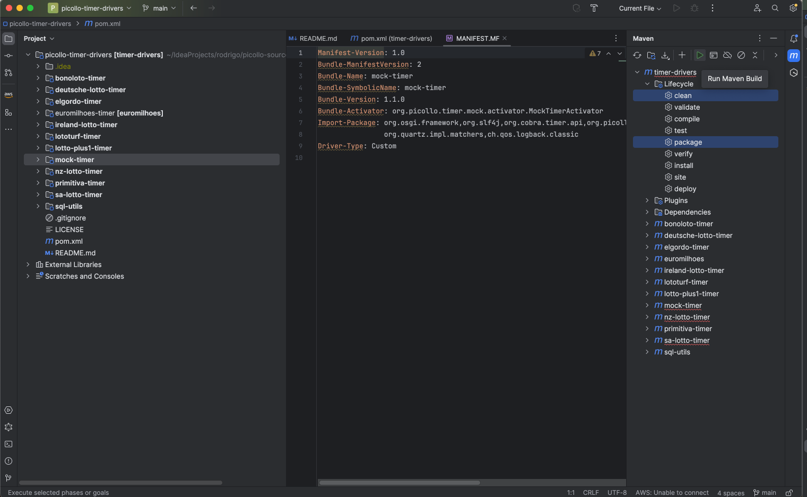
3. Then press Control key and select "clean" and "package" on your Maven view
4. After selecting click on "Run Maven Build" button (the green one on top of Maven View)
5. You should see the modules built on the Run view of IntelliJ, like this: 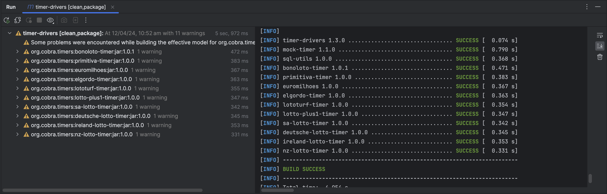

Now that the pico module is build lets deploy it in Picollo's node. Just follow:

1. Open your IntelliJ window with "picollo" project
2. If Picollo is not running, then run it just clicking "Run 'Picollo'" in the top toolbar. 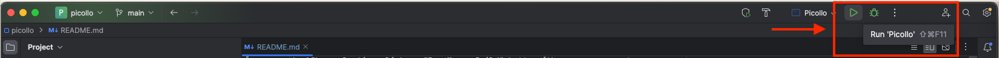
3. You will see Picollo started in the IntelliJ Run view 
4. Go to your IntelliJ window with "picollo-timer-drivers"
5. Open the "mock-timer"->target folder in the IntelliJ Project view and select "mock-timer-1.1.0.jar"
6. Use Control-C to copy that file 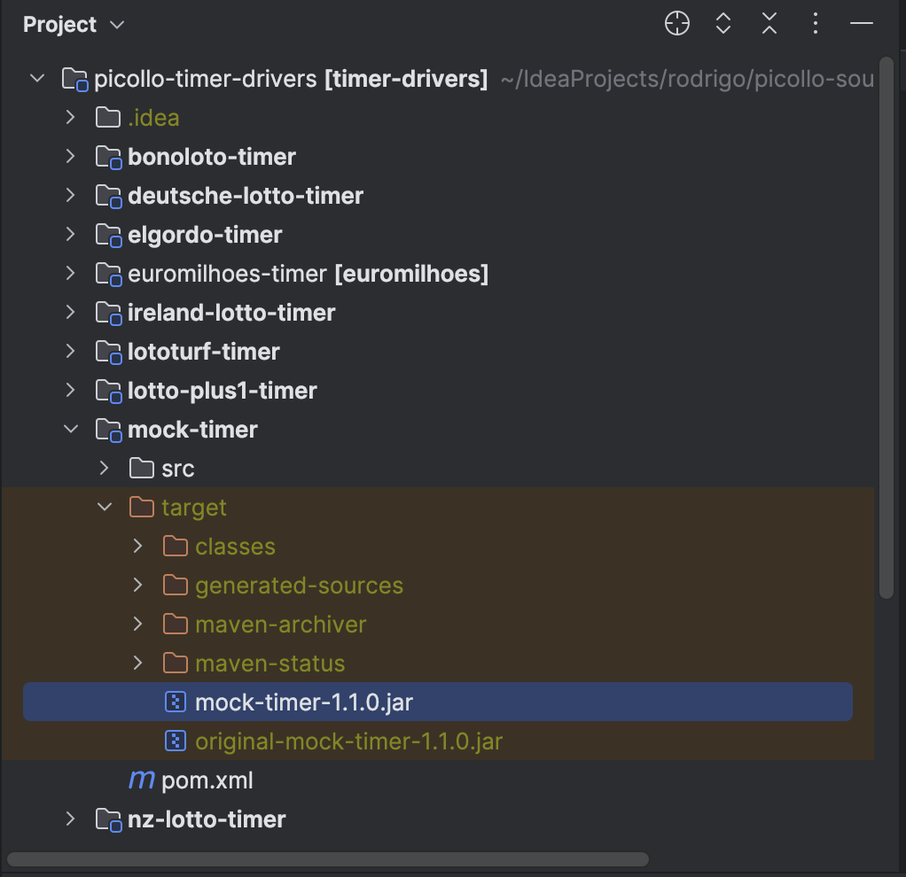
7. Go back to your IntelliJ window with "picollo" project
8. Paste the "mock-timer-1.1.0" in the Picollo's "code"->"deploy" folder 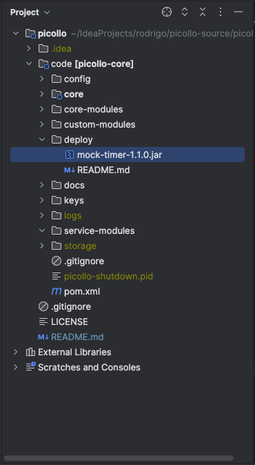
9. You should see on IntelliJ Run view: 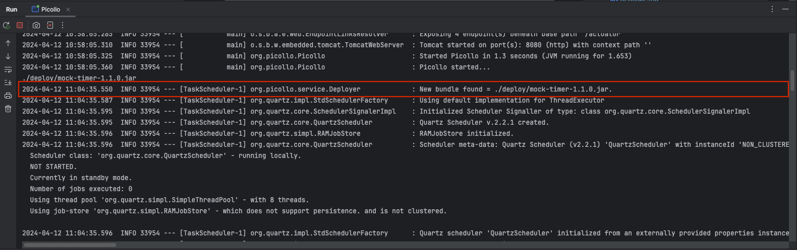
10. The module is now deployed, now you can see it on the "custom-modules" folder

The mock timer is only a small piece of code to test the timer functionality. You will see logs of it being generated on your Run view, where it is going to put a counter from 0 to 14 every minute.

It is also very important to mention that before deploying Pico modules, such as the Timer Mock described before, a configuration file need to be included in the "code"->"config" folder. Luckily for the Mock Timer there is already one there.
Remember, the name of your configuration file MUST be the same name of the driver without the versioning. 

*For instance: mock-timer-1.1.0.jar is going to have a configuration named mock-timer.properties.*

